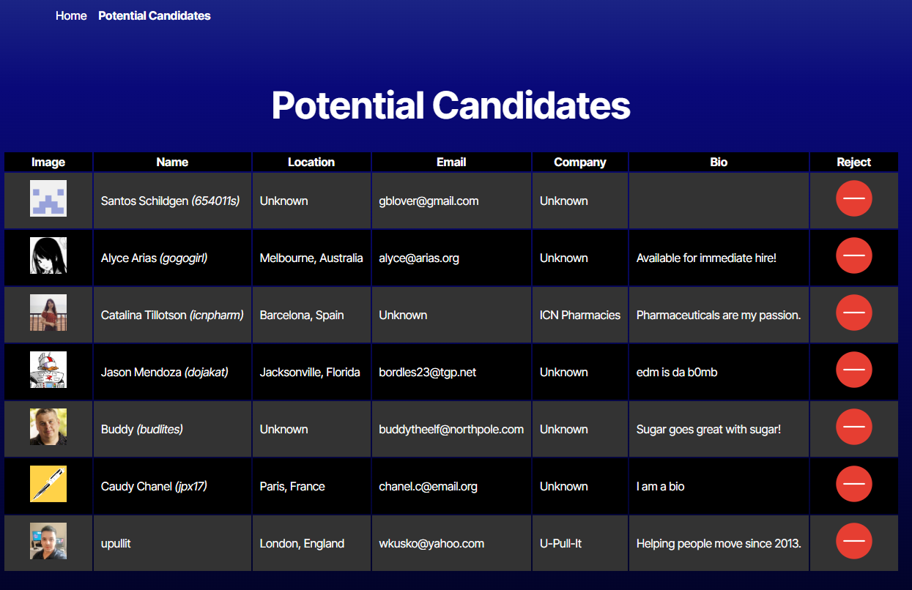

# CandidateSearch

A simple website which displays a selection of GitHub profiles and allows the user to add them to a list of potential candidates.

## Table of Contents

- [Installation](#installation)
- [Usage](#usage)
- [Testing](#testing)
- [Questions](#questions)

## Installation

To install, you will need a GitHub API key which needs to be added to a .env file in the root folder. You will then need to run `npm ci` to install dependencies.

## Usage

After installation, start the project locally with `npm run dev`. This will run a Vite instance hosting the application. Once running, you can open a browser window pointed at the Vite path to use the application.

## Testing

You can run the application using test data (as shown above) by setting the value of `VITE_TEST_DATA` to `true` in your `.env` file.

## Questions

I can be reached with questions at https://www.github.com/Prelle or via email at p.elayne.terry@gmail.com.

#### This README.md file was generated with the ReadmeGenerator located at https://www.github.com/Prelle/ReadmeGenerator.